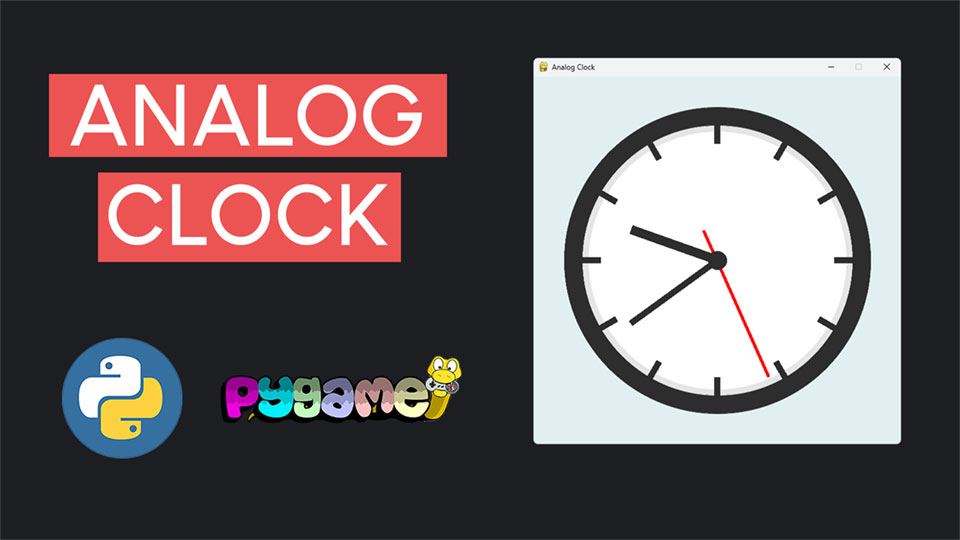

# Analog Clock with Pygame

This repository contains the code for a video tutorial on creating a fully functional analog clock using Python and Pygame.

## Video Tutorial

<p align="center">
  
</p>

<p align="center">
🎥 <a href="https://youtu.be/EnOoiqQxruU">Watch the Video Tutorial on YouTube</a>
</p>

## Overview

In this tutorial, we build a beautiful analog clock from scratch using Python and Pygame. The tutorial walks you through each step of the process, from setting up the project to creating clock components and implementing real-time updates.

## Features

- **Customizable Clock Face:** Learn how to create a professional-looking clock face with an outer rim, hour markers, and a polished design.
- **Dynamic Clock Hands:** Build hour, minute, and second hands that rotate in real time.
- **Object-Oriented Programming (OOP):** The project is structured using OOP principles to keep the code modular and organized.
- **Smooth Graphics:** Utilize anti-aliasing to create visually appealing components without jagged edges.

## Code Structure

- **clock.py:** Contains the `AnalogClock` class, which handles drawing the clock face, hands, and updates based on the current time.
- **main.py:** The main script that initializes the Pygame window, updates the clock, and renders it on the screen.

## How to Run

1. Clone this repository:
   ```bash
   git clone https://github.com/YOUR_USERNAME/analog-clock-pygame.git
   cd analog-clock-pygame
   ```

2. Ensure you have Python and Pygame installed. Install Pygame using pip:
   ```bash
   pip install pygame
   ```

3. Run the `main.py` script:
   ```bash
   python main.py
   ```

## Project Steps

This project is divided into 8 steps:
1. **Install Pygame** - Set up your environment and install the Pygame library.
2. **Create the Window & Main Loop** - Set up the Pygame window and its main loop.
3. **Draw the Clock Face** - Create the clock's outer rim, inner rim, and face.
4. **Add Hour Markers** - Design and position 12 evenly spaced hour markers.
5. **Create the Minute Hand** - Draw and rotate the minute hand based on the current time.
6. **Create the Hour Hand** - Build the hour hand with proportional rotation.
7. **Create the Seconds Hand** - Add the seconds hand with accurate offset and smooth rotation.
8. **Fetch Real Time** - Use Python's `datetime` module to fetch the current time and update the clock.

## Dependencies

- Python 3.x
- Pygame

## Contributing

Contributions are welcome! If you have ideas for improvements or additional features, feel free to open an issue or submit a pull request.

## License

This project is licensed under the MIT License. See the LICENSE file for details.

Enjoy coding your analog clock and don't forget to share your project! 🚀
